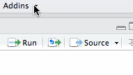

# s3browser 
A R Studio Addin that allows you to browse the files you have access to in S3

# Installation 

```{r}
#install.packages('devtools')
devtools::install_github('moj-analytical-services/s3browser')
```

# Usage


```{r}
s3browser:::file_explorer_s3()
```

The brow
